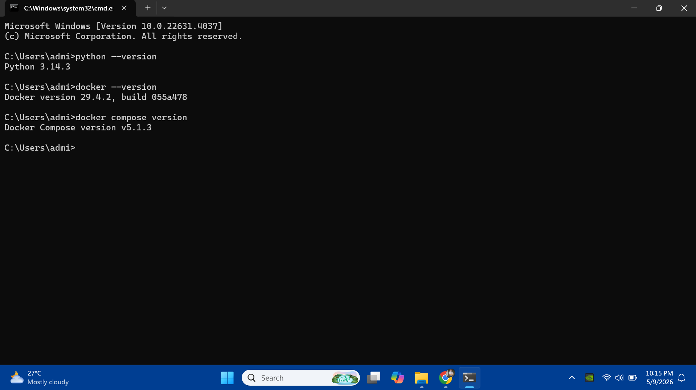
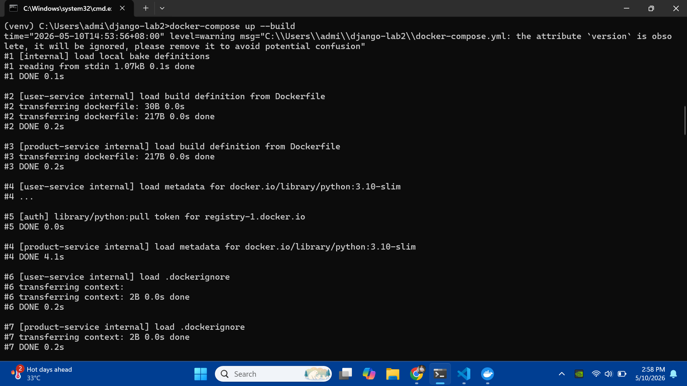
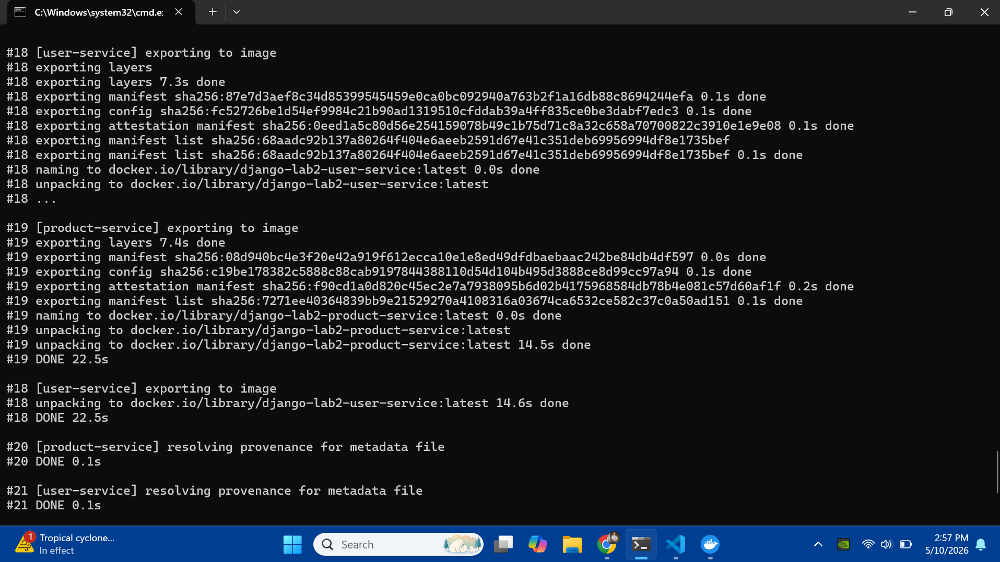
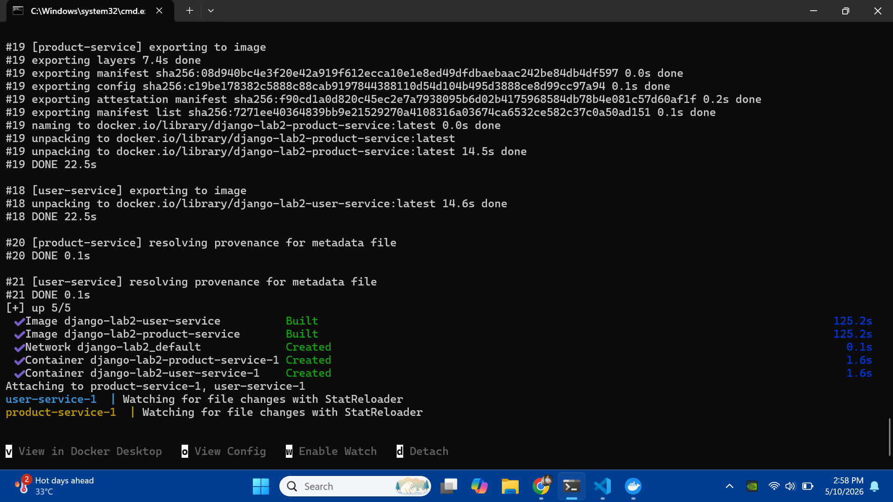
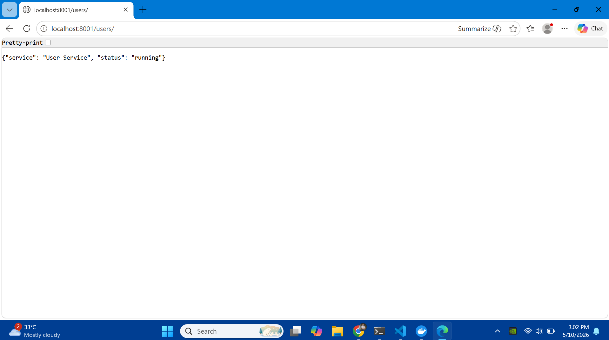
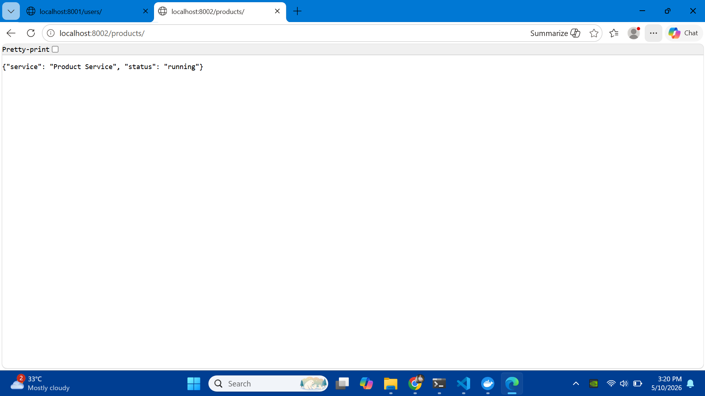
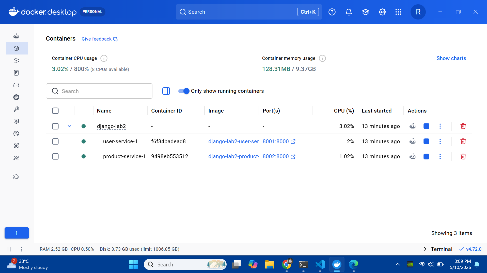
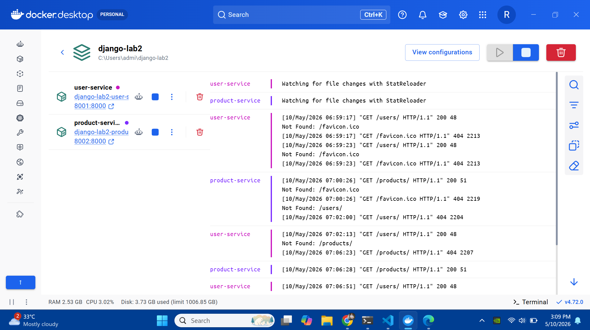
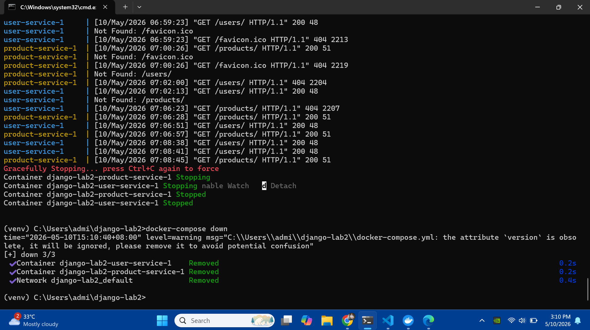

# Lab 2: Django Microservices Deployment Using Docker Compose

## 📌 Overview
This project demonstrates the containerization and orchestration of two independent Django microservices: **User Service** and **Product Service**. By using Docker Compose, we manage multiple containers, networking, and port mapping to create a unified local development environment.

## 🛠 Tech Stack
* **Backend:** Django (Python 3.14)
* **Containerization:** Docker
* **Orchestration:** Docker Compose
* **API Format:** JSON (REST-style)

## 📸 Step-by-Step Execution Outputs

### 1. Build & Execution
The following screenshots show the environment setup and the process of building the microservices using `docker-compose up --build`.

| Step | Description | Image |
|---|---|---|
| **01** | Python, Docker, and Compose Version Check |  |
| **02** | Initializing Docker Compose Build command |  |
| **03** | Docker exporting layers and naming service images |  |
| **04** | Containers active and watching for file changes |  |

### 2. Service Testing
Verifying the endpoints in the browser to confirm JSON responses from isolated containers.

* **User Service (Port 8001):** `http://localhost:8001/users/`
* **Product Service (Port 8002):** `http://localhost:8002/products/`




### 3. Monitoring & Cleanup
Using Docker Desktop to monitor resource usage and `docker-compose down` to clean up.

| Step | Description | Image |
|---|---|---|
| **07** | Healthy containers listed in Docker Desktop |  |
| **08** | Monitoring live multi-container log streams |  |
| **09** | Graceful shutdown and container removal |  |

---

## ❓ Guide Questions

### 1. How does Django support microservices development?
Django supports microservices through its modular architecture. While often seen as a "batteries-included" monolith, it can be stripped down to serve as a lightweight API (using `JsonResponse` or Django REST Framework). Its decoupled nature allows developers to create separate projects for specific domains (e.g., users vs. products) that communicate over HTTP.

### 2. What advantages do containers provide for Django deployment?
* **Environment Consistency:** Eliminates "it works on my machine" issues by packaging dependencies (Python version, libraries) together.
* **Isolation:** Services can run different versions of Python or Django without conflict.
* **Scalability:** Containers can be spun up or down quickly based on demand.

### 3. How would you enable service-to-service communication?
Communication can be achieved via:
* **Synchronous:** Using the `requests` library or `httpx` to make HTTP calls from one service to another’s internal Docker network URL (e.g., `http://user-service:8000`).
* **Asynchronous:** Implementing a message broker like RabbitMQ or Redis with Celery for background tasks and event-driven updates.

### 4. How can this setup be scaled using Kubernetes?
In Kubernetes, each Django service would be defined as a **Deployment** managing a set of **Pods**. A **Service** object would then provide a stable IP and load balance traffic across those pods. As traffic increases, Kubernetes can use a **Horizontal Pod Autoscaler (HPA)** to automatically increase the number of running containers.

---

## 🚀 How to Run

1.  **Clone the repository:**
    ```bash
    git clone <repository-url>
    cd django-lab2
    ```

2.  **Build and Run the containers:**
    ```bash
    docker-compose up --build
    ```

3.  **Access the services:**
    * User Service: `http://localhost:8001/users/`
    * Product Service: `http://localhost:8002/products/`

4.  **Shut down:**
    ```bash
    docker-compose down
    ```